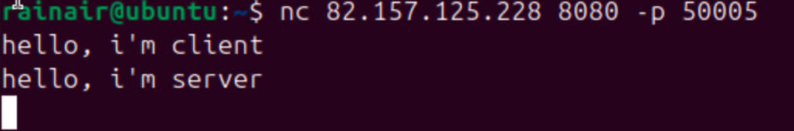
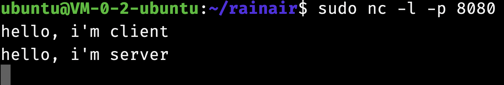
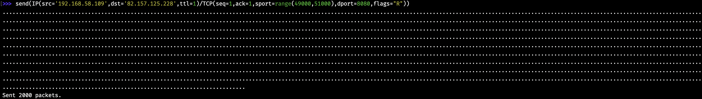
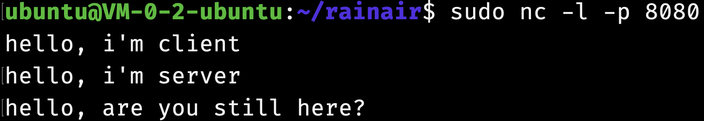
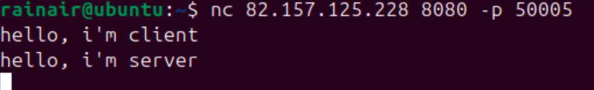

## TCP connection DoS Attack

### Description

Because the router lacks strict verification of the TCP packet seq number when doing NAT, the TCP connection could be maliciously interrupted.

### Steps

The internal IP of the router is 192.168.58.1, victim's is 192.168.58.109, attacker's is 192.168.58.110.

The server IP is 82.157.125.228.

(1) Server listening TCP port 8080:

victim connects to the server via Netcat, specify the source port is 50005:

They could communicate well:

(2) Attacker pretends to be a client and sends forged RST messages. RFC5961 proposes the Challenge ACK mechanism, which requires the seq number of the RST messages sent by the attacker must exactly match the seq number of the current connection to disconnect the connection.

However, due to the lack of strictly check the seq number of the Reset message on the intermediate router, the mapping of the connection recorded by the router at both ends could be maliciously cleared.

Because attack do not know the source port of the client, we should enumerate it:

(3) Server send message to client, now client cannot get this message.

